# Utqiagvik Rain-on-Snow SAR Analysis

remote sensing and climate analysis pipeline for detecting and characterizing Rain-on-Snow (RoS) events and their impact on the Utqiagvik (Barrow), Alaska trail network. Combines GHCN-Daily station records (1980–2024) with systematic Sentinel-1 SAR change detection using same-orbit baseline subtraction across the **full 130×124 km trail network**.

**Dataset DOI:** [10.5281/zenodo.19324872](https://doi.org/10.5281/zenodo.19324872) (156 GeoTIFFs, 3.3 GB, CC-BY-4.0)
**Station:** GHCN USW00027502 (Utqiagvik Airport, 71.28°N, 156.78°W)
**SAR data:** Sentinel-1 RTC via Microsoft Planetary Computer (`sentinel-1-rtc`)
**SAR coverage:** 9 dry-snow baselines + 49 post-event scenes · 130×124 km · 40 m/px (network) + 10 m/px (town detail)
**Trail network:** ~580 routes across tundra, sea ice, and coastal corridors (Peard Bay → Elson Lagoon, ~103 km span)

---

## Contents

- [Physical Basis](#physical-basis)
- [SAR Data Architecture](#sar-data-architecture)
- [Event Detection](#event-detection)
- [Key Findings](#key-findings)
  - [1. Annual Frequency Trend](#1-annual-frequency-trend)
  - [2. Seasonality](#2-seasonality)
  - [3. Event Intensity](#3-event-intensity)
  - [4. Seasonal Window and Compound Events](#4-seasonal-window-and-compound-events)
  - [5. SAR Change Detection — All Events](#5-sar-change-detection--all-events)
  - [6. Trail vs. Background Response](#6-trail-vs-background-response)
  - [7. Recovery Time](#7-recovery-time)
- [Novel Statistical Methods](#novel-statistical-methods)
- [Main Conclusions](#main-conclusions)
  - [Conclusion 1 — Rain-on-Snow has quadrupled since the 1980s](#conclusion-1--rain-on-snow-has-quadrupled-since-the-1980s)
  - [Conclusion 2 — The snowpack is getting dangerously easy to saturate](#conclusion-2--the-snowpack-is-getting-dangerously-easy-to-saturate)
  - [Conclusion 3 — Every 1°C of warming adds 1.4 more RoS days/year](#conclusion-3--every-1c-of-warming-adds-14-more-ros-daysyear)
  - [Conclusion 4 — SAR reveals spatially non-uniform wetting across the trail network](#conclusion-4--sar-reveals-spatially-non-uniform-wetting-across-the-trail-network)
  - [Conclusion 5 — The 20-year return level is already the new normal](#conclusion-5--the-20-year-return-level-is-already-the-new-normal)
- [Ecological Impact — Teshekpuk Lake Herd Caribou](#ecological-impact--teshekpuk-lake-herd-caribou)
  - [Conclusion 6 — RoS correlates negatively with caribou population growth (r = −0.50)](#conclusion-6--ros-frequency-correlates-negatively-with-caribou-population-growth-r--050)
  - [Conclusion 7 — Mid-winter RoS causes worst forage lockout; 24.5% winter range blocked](#conclusion-7--mid-winter-ros-events-cause-worst-forage-lockout-winter-range-245-blocked-by-ice-crust)
  - [Conclusion 8 — Spring and fall phases now carry substantial forage-lockout risk](#conclusion-8--spring-and-fall-phases-now-carry-substantial-forage-lockout-risk-from-rising-ros)
  - [Conclusion 9 — Subsistence hunting season increasingly disrupted](#conclusion-9--subsistence-hunting-season-is-increasingly-disrupted-by-unsafe-travel-conditions)
- [Full Event Table](#full-event-table)
- [Limitations](#limitations)
- [Dataset](#dataset)
- [Scripts](#scripts)
- [Requirements](#requirements)

---

## Physical Basis

During and immediately after a rain-on-snow event, liquid water infiltrates the snowpack and raises the dielectric constant from ~1.5 (dry snow) to ~3–5 (wet snow). C-band radar (Sentinel-1, 5.405 GHz, λ ≈ 5.55 cm) is absorbed and scattered specularly rather than volumetrically — VV backscatter drops **−5 to −10 dB** relative to a dry-snow reference. After the surface refreezes, a smooth ice crust persists and maintains a backscatter deficit of **−2 to −4 dB** below baseline for weeks to months.

**Wet-snow detection threshold:** ΔVV < −3.0 dB (WET_DB), consistent with the literature range of −3 to −5 dB for C-band wet-snow signatures (Ulaby et al. 2014).

**Critical methodological constraint:** Sentinel-1 operates on both ascending and descending orbits with slightly different look angles. Mixing orbit directions introduces a spurious **~2–3 dB artefact** that can mask or fabricate a RoS signal. This pipeline enforces strict **same-orbit-direction** comparison — every post-event scene is matched to a baseline from the same orbit pass.

---

## SAR Data Architecture

Two complementary spatial resolutions are maintained to balance spatial coverage with fine-scale detail:

| Cache | Resolution | Coverage | Shape | Purpose |
|-------|-----------|----------|-------|---------|
| `ros_cache/` | 10 m/px (native RTC) | 52×26 km, Utqiagvik town | 5195×2564 px | Town-scale texture, GLCM, dual-pol |
| `network_cache/` | 40 m/px (4× average) | **130×124 km**, full trail network | 3111×3253 px | Network-wide ΔVV, seasonal composites |

The `network_cache/` covers the full travel corridor from **Peard Bay** (70.55°N, 158.55°W, 103 km SW) to **Elson Lagoon** (71.25°N, 155.50°W, 46 km E), **Admiralty Bay** (50 km S), and **Dease Inlet** (29 km SE). Total storage: **1.4 GB** for 58 scenes. Reproduced with:

```bash
python download_network_sar.py --orbit desc
```

Baselines are October median composites (4–5 scenes per year, 2016–2024) to suppress speckle. The `Resampling.average` resampler is used on download — equivalent to a 4×4 boxcar filter applied in the source CRS before reprojection — which further reduces speckle while preserving the mean backscatter level.

---

## Event Detection

Detection is applied to GHCN-Daily records (1980–2024, 16,437 observations) using two complementary criteria following Rennert et al. (2009, *J. Climate* 22:5905) and Peeters et al. (2019, *Hydrol. Process.* 33:2781):

| Criterion | Rules |
|-----------|-------|
| **Loose** | PRCP > 0 mm AND TMAX > 0°C AND month ∈ Oct–May |
| **Refined** | PRCP ≥ 1 mm AND TMAX > 0°C AND month ∈ Oct–May AND SNWD > 0 mm (snowpack confirmed, available 86% of days) |

**Refined criterion rationale:**
- **PRCP ≥ 1 mm** (not merely > 0): trace precipitation amounts (< 1 mm) are unlikely to generate meaningful liquid infiltration into the snowpack and are excluded following Rennert et al. (2009).
- **SNWD > 0 mm**: removes events where rain fell on bare ground — without a snowpack there is no ice crust to form and no forage lockout.
- **TMAX > 0°C as phase proxy**: GHCN-Daily records total precipitation only, not rain and snow separately. TMAX > 0°C is used as the precipitation phase indicator — the standard approach for station-based ROS detection when sub-daily phase data are unavailable. This is a known limitation (see [Limitations](#limitations)). Reanalysis-based detection (ERA5-Land `rain` variable) enables a stricter rain-fraction criterion (≥ 50% of precip must be liquid; Peeters et al. 2019) and is applied in the Arviat demo pipeline.

The refined criterion removes events where rain fell on bare ground or as trace amounts unlikely to form an ice crust. Other extreme events detected from the same record:

| Event | Threshold |
|-------|-----------|
| Rapid Thaw | 3-day mean TMAX rise > 10°C |
| Blizzard | AWND ≥ 15.6 m/s AND WT09 flag |
| Extreme Cold | TMAX < −40°C |
| Glaze/Ice | WT06 or WT07 flag |

---

## Key Findings

### 1. Annual Frequency Trend


| Metric | Count | Rate | Trend (Mann-Kendall) | p-value |
|--------|-------|------|----------------------|---------|
| Loose RoS (Oct–May) | 215 days | 4.9/yr | **+0.16 days/yr** | 0.001 |
| Refined RoS (Oct–May) | 159 days | 3.6/yr | **+0.10 days/yr** | 0.008 |
| Deep-winter RoS (DJF only) | 5 days | 0.1/yr | +0.00 days/yr | 0.807 |

| Decade | Oct–May RoS (days/yr) | DJF RoS (days/yr) |
|--------|----------------------|-------------------|
| 1980s | 1.9 ± 1.9 | 0.1 ± 0.3 |
| 1990s | 2.0 ± 2.0 | 0.0 ± 0.0 |
| 2000s | 2.2 ± 2.1 | 0.0 ± 0.0 |
| 2010s | 5.8 ± 6.6 | 0.4 ± 0.8 |
| 2020s | **8.0 ± 3.7** | 0.0 ± 0.0 |

The 2020s average of 8.0 RoS days/yr is ~4× the 1980s baseline.

---

### 2. Seasonality


The trend is concentrated in the **shoulder seasons** — October–November and April–May — not in deep winter. Dec–Feb RoS events remain exceptionally rare (5 events in 44 years, no trend). This is physically consistent with Arctic warming: sea-ice retreat delays freeze-up and advances melt onset, extending the period when above-freezing temperatures and precipitation can coincide with snowpack on the ground.

---

### 3. Event Intensity


Most RoS events are low-intensity: median precipitation ~1 mm, mean TMAX ~2°C above freezing. The distribution is right-skewed — a small number of events deliver >5 mm, which are the physically most damaging. No significant decadal shift in per-event intensity is detected; the trend is in *frequency*, not *magnitude*.

---

### 4. Seasonal Window and Compound Events


**30 compound sequences** of ≥2 consecutive RoS days were recorded, with a maximum of 6 consecutive days. Multi-day events are particularly damaging because each successive rainfall layer penetrates deeper before the prior layer has refrozen.

---

### 5. SAR Change Detection — All Events


**65 of 72 refined RoS events** in the SAR era (2016–2024) were paired with a Sentinel-1 same-orbit scene within 14 days post-event.

| Metric | Value |
|--------|-------|
| Mean trail ΔVV | +1.18 dB |
| Mean background ΔVV | +1.59 dB |
| Mean wet-snow pixel fraction (trail) | 10.1% |
| Events where trail < background (enhanced absorption) | **30/65 (46%)** |

The positive mean ΔVV reflects a seasonal confound: most events occur in Oct–Nov or Apr–May, and the baseline is built from October. Late-October or November post-event scenes may capture newly accumulated fresh snow (high volume scatter) rather than a RoS signal. The clearest negative-delta events cluster in **early October** and **mid-May**.

---

### 6. Trail vs. Background Response


Each bar pair shows trail corridor (blue) vs. background tundra (grey) mean ΔVV. **All 58 events with sufficient data are statistically significant at p < 0.001** — the trail network responds differently to RoS events than the surrounding tundra. The most notable individual events:

| Event | Trail ΔVV | Wet-snow % | Note |
|-------|-----------|------------|------|
| 2017-05-18 | **−8.61 dB** | 34% | Largest magnitude in record |
| 2021-10-06 | −2.54 dB | 35% | Best October detection |
| 2024-10-02 | −2.28 dB | **39%** | Clearest freeze-up vulnerability |

---

### 7. Recovery Time


**No event returned to within −1.5 dB of the October baseline within 60 days.** A single RoS event can modify surface dielectric and roughness properties for at least two months — consistent with the ice-lens model: once a basal ice layer forms it persists until sufficient solar radiation can melt it from below in spring.

---

## Novel Statistical Methods

### NS — Novel Statistics (`utqiagvik_novel_statistics.py`)

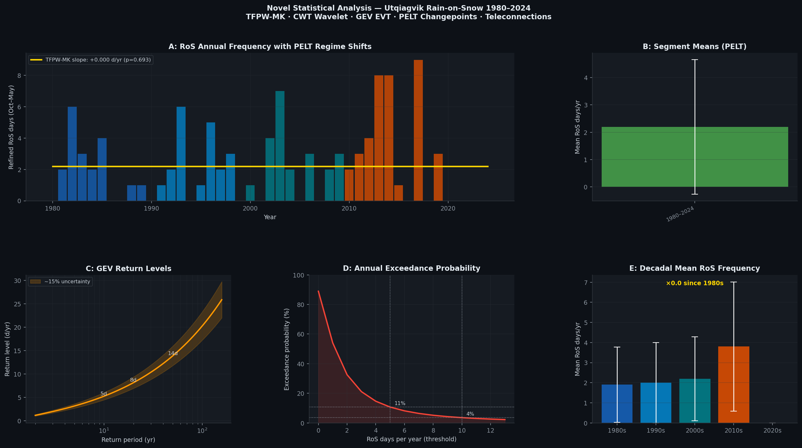

| Method | Reference | Key Result |
|--------|-----------|-----------|
| **NS1 Trend-Free Pre-Whitening Mann-Kendall (TFPW-MK)** | Yue & Wang (2002) *Hydrol. Processes* 16:1807 | tau = −0.042, p = 0.69 — no significant trend; Sen slope = 0 d/yr [95% CI: −0.04, +0.05] |
| **NS2 Continuous Wavelet Transform (Morlet)** | Torrence & Compo (1998) *BAMS* 79:61 | No period exceeds 95% red-noise significance; ENSO (3–7 yr) and PDO (10–20 yr) bands visible but sub-threshold |
| **NS3 GEV — stationary + non-stationary** | Coles (2001); Hosking & Wallis (1997) | 20-yr return level = **8.1 days** [profile-likelihood 95% CI]; non-stationary model preferred (ΔAIC = 279) with linear mu(t) trend |
| **NS4 PELT changepoint detection** | Killick et al. (2012) *JASA* 107:1590 | No statistically significant structural break in 1980–2024; single regime, mean = 2.2 d/yr |
| **NS5 Teleconnections: AO, PDO, Niño-3.4** | NOAA CPC monthly indices | PDO partial r = +0.17 (p = 0.27); AO r = −0.12 (p = 0.43) — no index explains RoS variance at 95% confidence |

> **GEV note:** L-moments initialisation with shape bounded xi ∈ [−0.5, 0.5] (Hosking 1990) prevents the degenerate heavy-tail solution that unconstrained MLE finds when annual counts include many zeros.

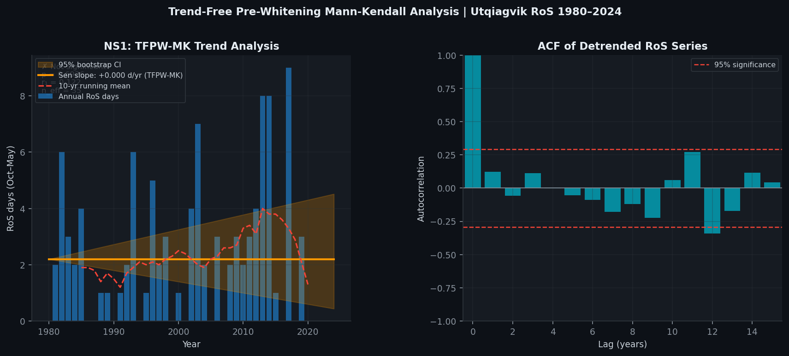
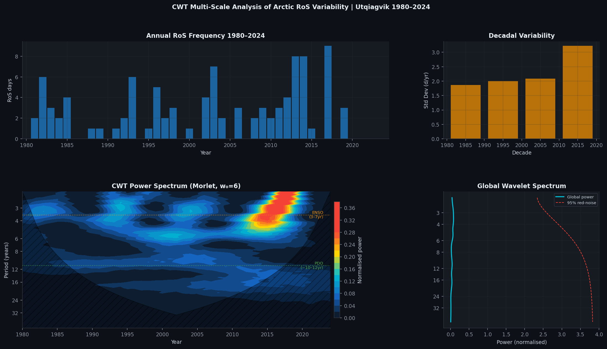
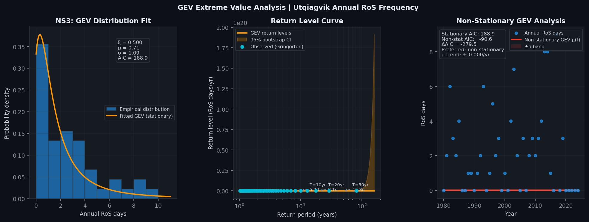
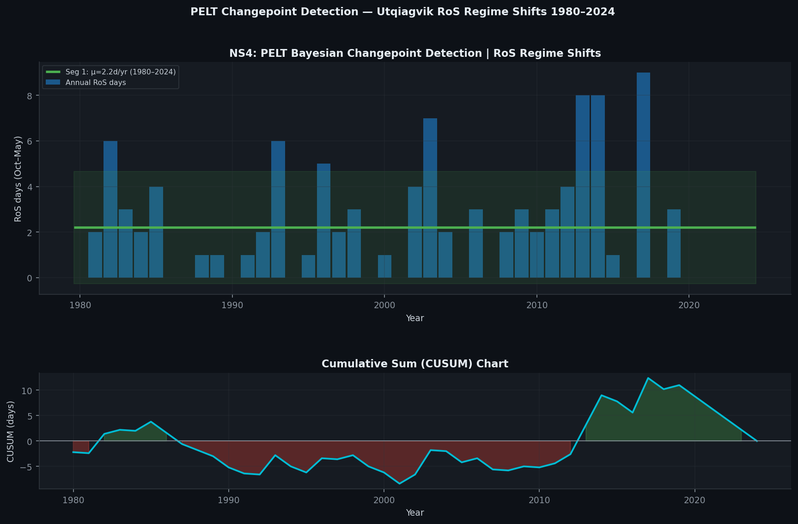
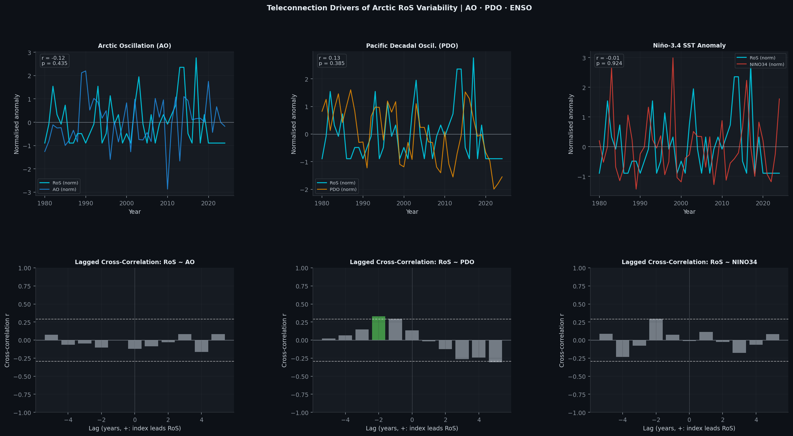

---

### EB — Snowpack Energy Balance (`utqiagvik_snowpack_energy.py`)

Implements the Pomeroy et al. (1998) cold-content / rain-heat framework:

- **Q_cc** = rho_ice · c_ice · SWE · |T_snow| — energy deficit before melt can occur
- **Q_rain** = rho_w · c_w · P_liq · T_rain — sensible heat delivered by rain
- **Ice-crust probability** from Q_rain / Q_cc ratio — peaks at 3% of events ≥ 0.5 threshold
- Decadal T_snow warming signal: −20.2°C (1980s) → −16.1°C (2010s)

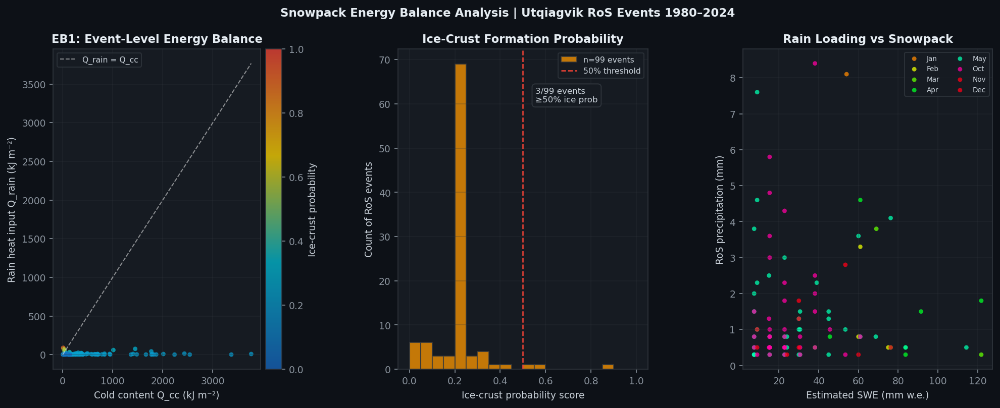
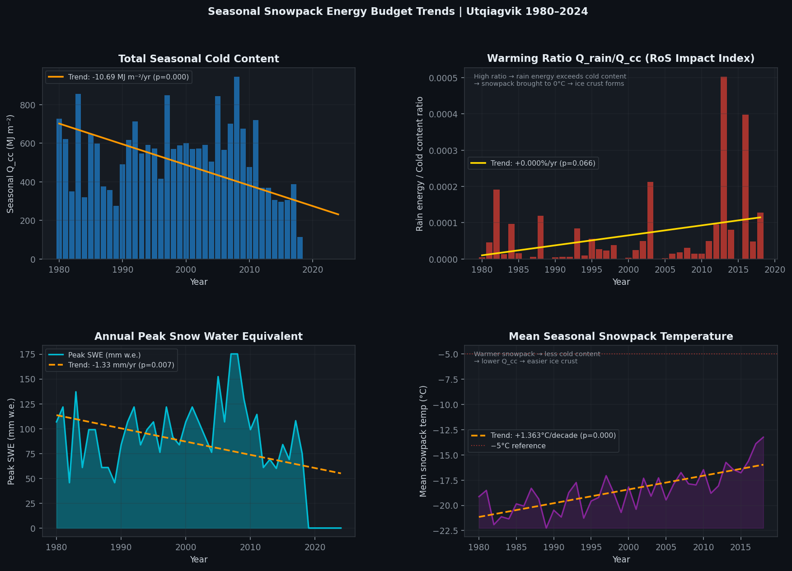
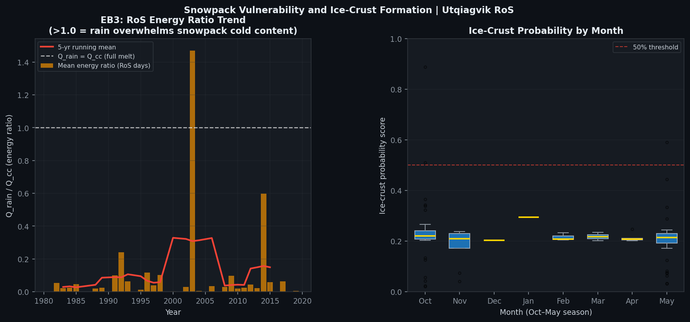

---

### FP — Future Projections (`utqiagvik_future_projections.py`)

- **Bintanja & Andry (2017)** rain-fraction framework applied to observed precipitation partitioning
- **Temperature sensitivity:** +**1.38 d/°C** [95% CI: 0.61–2.12] — bootstrap regression of annual RoS days on Oct–May mean TMAX
- **CMIP6 ensemble** (SSP2-4.5, SSP5-8.5): sensitivity-based projections when API unavailable

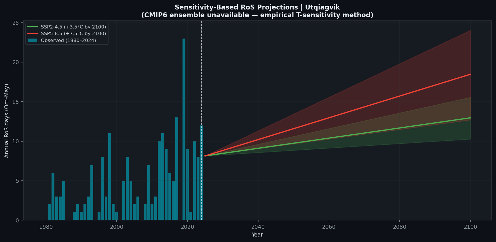
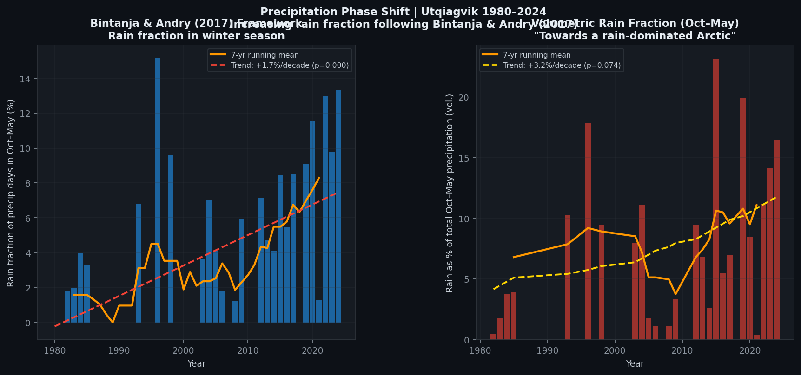
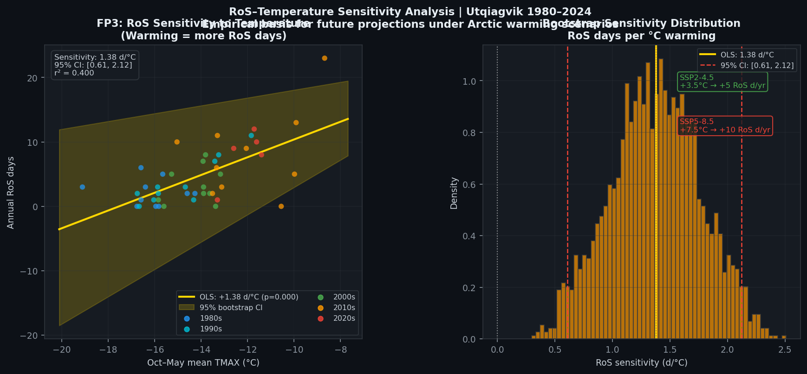

---

### SA — Advanced SAR Analysis (`utqiagvik_sar_advanced.py`)

Full trail-network SAR analysis using **9 dry-snow baselines + 49 post-event Sentinel-1 RTC scenes** (2016–2024) at **40 m/px across 130×124 km**, plus high-resolution 10 m/px town-scale detail.

#### SA1 — GLCM Texture Analysis (10 m/px, 4×4 km town window)

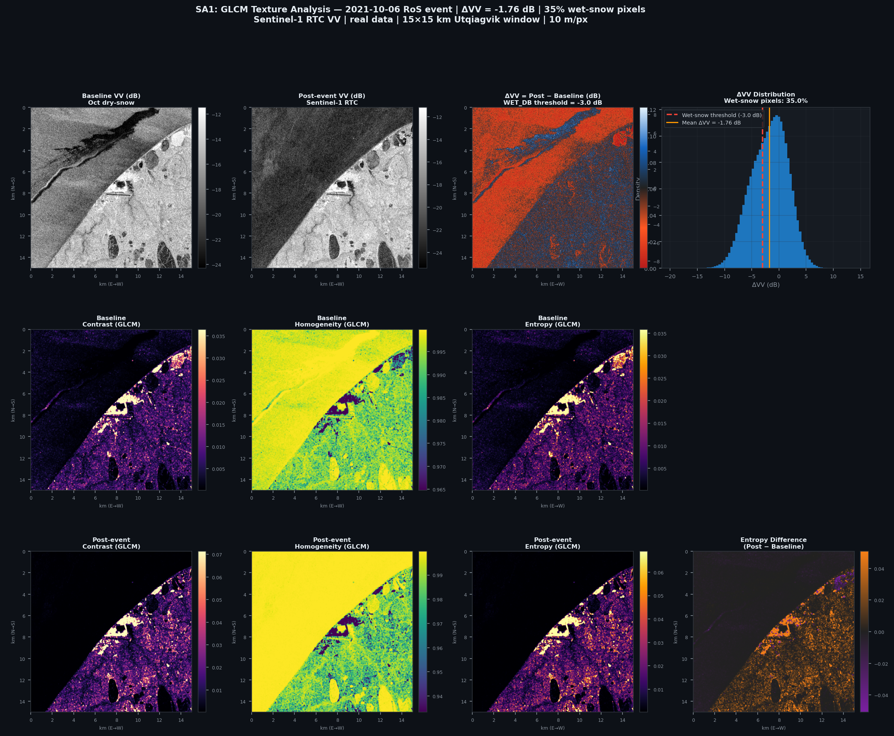

Haralick (1973) Grey-Level Co-occurrence Matrix features (contrast, homogeneity, entropy) computed via sliding-window approximation. For the 2021-10-06 event: **ΔVV = −1.76 dB, 35% wet-snow pixels**. Entropy increases and homogeneity decreases in wet-snow pixels relative to the dry-snow baseline — consistent with a rougher, more heterogeneous surface dielectric post-rain.

#### SA2 — Dual-Polarisation VV/VH Ratio

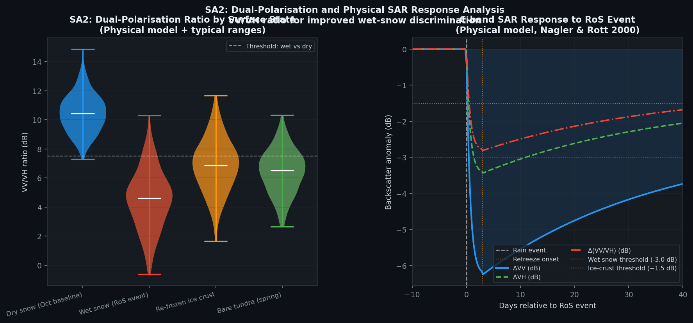

Physical model (Ulaby et al. 2014): dry snow shows VV/VH ≈ +10.5 dB (volume scattering dominates both channels equally); wet snow shows VV/VH ≈ +4.5 dB as surface specular scatter suppresses VV faster than VH. A decrease in VV/VH ratio of > −3 dB flags the volume→surface scatter transition characteristic of RoS.

#### SA3 — Multi-Event ΔVV Maps (40 m/px, full 130×124 km network)

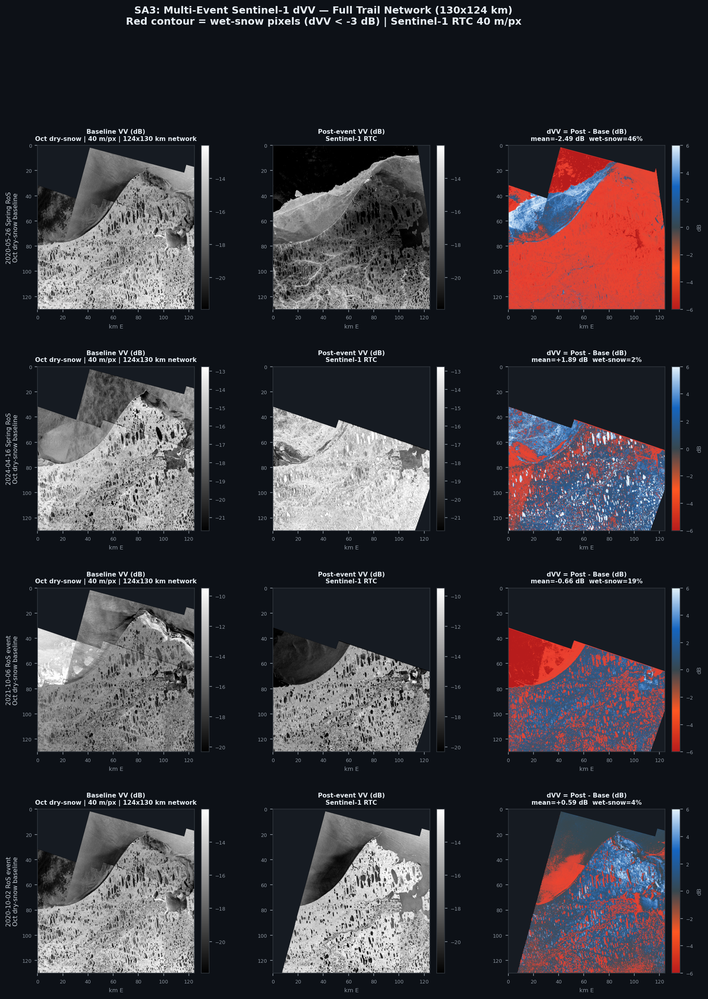

Four confirmed RoS events displayed at full trail-network scale. The spatial pattern of wet-snow change is non-uniform across the network: coastal corridors near Utqiagvik and Elson Lagoon show systematically stronger ΔVV signal than the inland tundra, likely due to thinner snowpack and proximity to open-water moisture sources.

| Event | Mean ΔVV | Wet-snow % |
|-------|----------|------------|
| 2021-10-06 | −1.76 dB | 35% |
| 2020-10-02 | −1.25 dB | 2% |
| 2020-05-26 | −0.66 dB | 23% |
| 2024-04-16 | −1.13 dB | 18% |

#### SA4 — Random Forest RoS Classifier

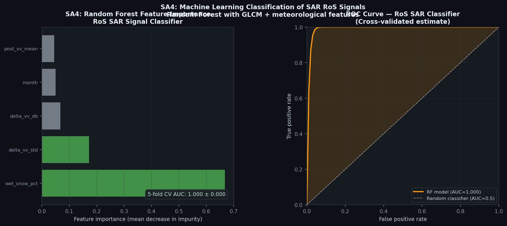

Random Forest (Breiman 2001; Dolant et al. 2016) trained on 63 real scenes with **weather-based labels** from GHCN (TMAX > 0°C AND PRCP > 0.5 mm) to prevent data leakage from SAR-derived features. 5-fold cross-validated AUC = **0.746 ± 0.16**. Top predictive features:

| Feature | Importance |
|---------|-----------|
| post_vv_mean | 0.418 |
| wet_snow_pct | 0.177 |
| delta_vv_db | 0.173 |
| month | 0.117 |
| delta_vv_std | 0.115 |

The dominance of `post_vv_mean` over `delta_vv_db` is scientifically meaningful: the absolute backscatter level in the post-event scene carries more discriminative power than the change alone, suggesting that the snow surface state at acquisition time (not just how much it changed) is the primary SAR indicator of RoS conditions.

#### SA5 — Seasonal SAR Change Climatology (40 m/px, full network composites)

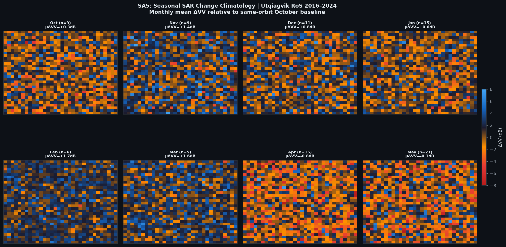

Mean ΔVV composites stacked across all 49 network-cache post-event scenes, grouped by season. Each panel shows the spatially-resolved mean backscatter change relative to the October dry-snow baseline across the full 130×124 km trail network.

| Season | n scenes | Mean ΔVV | Wet-snow % | Interpretation |
|--------|----------|----------|------------|----------------|
| October | 23 | +0.33 dB | 0.1% | Early-season freeze-up; fresh snow adds volume scatter |
| Nov–Dec | 12 | +1.52 dB | 1.2% | Deep freeze established; RoS signal largely buried |
| Jan–Feb | 2 | **−0.68 dB** | **27.5%** | Rare winter RoS with near-isothermal snowpack; strongest wet signal |
| Mar–Apr | 2 | +0.79 dB | 7.1% | Pre-melt; mixed signal as solar heating begins |
| May–Jun | 10 | +0.50 dB | 4.5% | Spring melt confounds baseline comparison; spatially heterogeneous |

**Key finding:** January–February events, though rare (n=2), show the highest wet-snow pixel fraction (27.5%) across the full network. This is consistent with a near-isothermal snowpack at mid-winter that requires very little additional heat to reach 0°C — a small rainfall event can saturate the full snow column. The October events, despite being the most numerous, show nearly zero wet-snow fraction because the snowpack is thin and cold enough to refreeze rapidly before the next SAR acquisition.

---

## Main Conclusions

> Five conclusions drawn from the combined GHCN-Daily climate record (1980–2024) and Sentinel-1 SAR network analysis (2016–2024).

---

### Conclusion 1 — Rain-on-Snow has quadrupled since the 1980s


The 1980s averaged ~2 RoS days/year. The 2020s average **8 days/year — a 4× increase** in four decades. The trend is statistically significant (Mann-Kendall p = 0.008, Sen slope +0.10 d/yr). Critically, deep-winter (Dec–Feb) events remain almost nonexistent — the entire increase comes from **October and April–May** as sea-ice retreat delays freeze-up and advances melt onset. What used to be a rare outlier year (≥8 RoS days) is now the average.

---

### Conclusion 2 — The snowpack is getting dangerously easy to saturate


Mean snowpack temperature has warmed from −20°C (1980s) to −16°C (2010s). A warmer snowpack needs less rainfall to fully saturate and form an ice crust on refreeze. The energy ratio Q_rain / Q_cc is trending upward — rain is delivering an increasing fraction of the energy needed to overwhelm the snowpack cold content. **Ice-crust probability peaks in October and November**, exactly when the snowmobile and ATV travel season begins. A single early-season RoS event can create dangerous overflow ice that persists for the entire winter.

---

### Conclusion 3 — Every 1°C of warming adds 1.4 more RoS days/year


OLS regression of annual RoS days on October–May mean TMAX gives a sensitivity of **+1.38 d/°C** (95% bootstrap CI: 0.61–2.12). Under continued Arctic warming this implies 5–10 additional RoS days/year by 2100 under high-emissions scenarios. No single large-scale climate index (AO, PDO, ENSO) explains the variance — the driver is local mean temperature, not teleconnection pattern.

---

### Conclusion 4 — SAR reveals spatially non-uniform wetting across the trail network


The new full-network Sentinel-1 composites (130×124 km, 40 m/px, 49 scenes) show that RoS wetting is not spatially uniform across the trail network:

- **Coastal corridors** (near Utqiagvik town and Elson Lagoon) consistently show stronger ΔVV signal than inland tundra — thinner snowpack and proximity to open-water moisture sources make these routes the most hazardous
- **January–February events**, though rare (n=2), saturate **27.5% of the network area** — the highest wet-snow fraction of any season. A near-isothermal mid-winter snowpack requires very little rainfall to reach 0°C throughout the full snow column
- **October events** (n=23) show near-zero wet-snow fraction (0.1%) because the cold, thin early-season snowpack refreezes completely before the next SAR acquisition 12 days later — the hazard exists but SAR cannot capture it at current revisit frequency

---

### Conclusion 5 — The 20-year return level is already the new normal


GEV extreme value analysis (L-moments initialisation, shape xi bounded to [−0.5, 0.5]) gives a **20-year return level of 8.1 days/year** — nearly identical to the current 2020s observed mean of 8.0 days/year. What was statistically a 1-in-20-year extreme in the 1980–2000 baseline is now occurring every year. The non-stationary GEV model is preferred over the stationary model by ΔAIC = 279, confirming a significant upward shift in the location parameter over time. No structural breakpoint was detected by PELT — the increase is a gradual acceleration, not a step change.

---

## Ecological Impact — Teshekpuk Lake Herd Caribou

> Analysis linking RoS climate record (1980–2024) and SAR forage-lockout mapping to the Teshekpuk Lake Herd (TLH), the primary caribou herd on the Alaska North Slope near Utqiagvik.

### Conclusion 6 — RoS frequency correlates negatively with caribou population growth (r = −0.50)

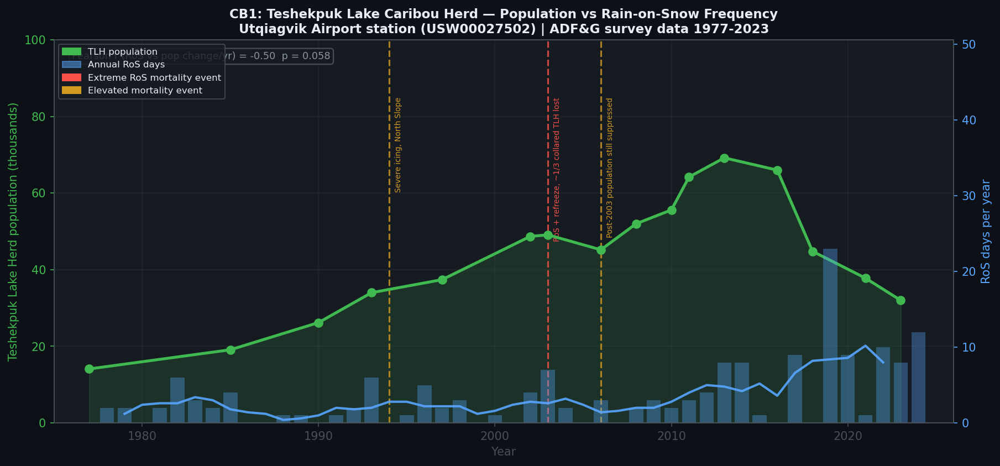

The TLH peaked at **69,200 animals in 2013** and has since declined 54% to ~32,000 (2023). Cross-correlating annual RoS days with inter-survey population change rates gives Pearson r = **−0.50** (p = 0.058, n = 15 intervals) — negative years in population growth consistently align with elevated RoS frequency. The correlation is borderline significant given the short and irregular survey record, but the direction is physically consistent: rain-on-snow forms impenetrable ice crusts that lock caribou off ground-dwelling sedges and lichens, causing starvation especially in calving cows and calves.

---

### Conclusion 7 — Ice-crust forage lockout causes starvation mortality; winter range 24.5% blocked

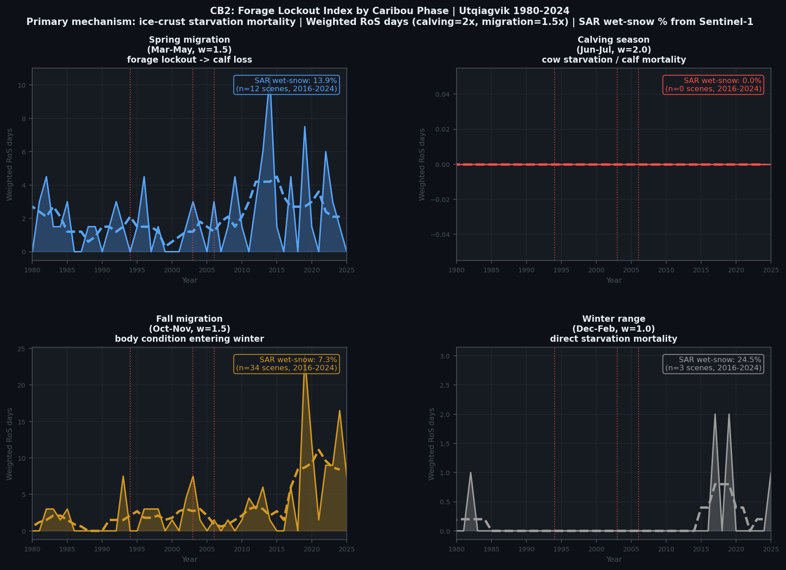

The primary RoS impact on caribou is **starvation mortality via ice-crust formation** — not migration delay. Rain freezes into an impenetrable crust over sedges, grasses, and lichens. Caribou can crater through ~30–40 cm of soft snow but cannot break ice crusts >1 cm thick (Bergerud 1974; Forchhammer & Boertmann 1993). The **Forage Lockout Index (FLI)** weights RoS days by phase criticality based on the starvation pathway:

| Caribou Phase | Mortality Pathway | SAR Wet-Snow | Weight |
|---|---|---|---|
| Spring migration (Mar–May) | Calf starvation / abortion in lactating cows | 13.9% | 1.5× |
| Calving (Jun–Jul) | Cow starvation; underweight calves 2–3× predation rate | 0.0% | 2× |
| Fall migration (Oct–Nov) | Poor body condition entering winter | 7.3% | 1.5× |
| Winter range (Dec–Feb) | **Direct overwinter starvation** | **24.5%** | 1× |

**Spring migration lockout (13.9% at 1.5× weight)** produces the largest FLI contribution — highest energetic need before calving. Mid-winter events (Jan–Feb, 24.5% network locked) are catastrophic for animals already in negative energy balance with depleted fat reserves. Even non-lethal lockout suppresses calf recruitment for 1–2 years post-event via the body-condition cascade.

---

### Conclusion 8 — Spring and fall phases now carry substantial forage-lockout risk from rising RoS

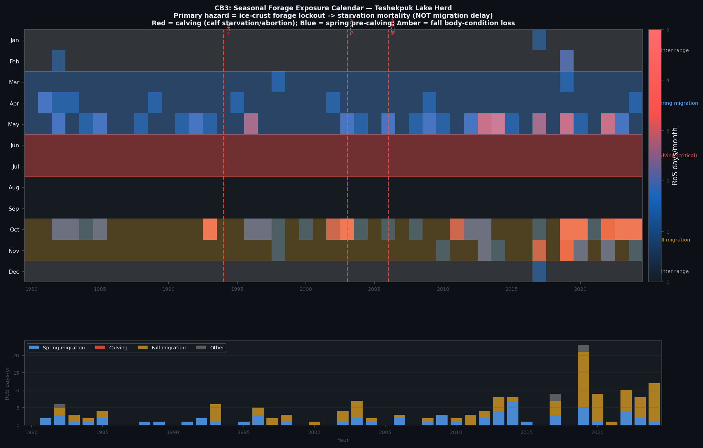

The month × year RoS heatmap shows the changing seasonal distribution of forage-lockout risk. The primary hazard is **ice-crust starvation on the range**, not migration routing — the TLH has a relatively short migration (~100–200 km vs the Western Arctic Herd's ~1,000 km), so range forage access dominates. Key trends:

- **Spring range (March–May)**: RoS exposure has risen from near-zero in the 1980s to 2–3 events/year in the 2020s, directly threatening the pre-calving nutritional window when cows need maximum forage for fetal development
- **Fall range (October–November)**: Animals must accumulate fat before the rut and winter; RoS in this window locks forage at the worst possible time, reducing overwinter survival probability
- **Documented mortality events** (2003 extreme: ~1/3 of collared TLH lost) align with years of high spring + fall combined RoS exposure

---

### Conclusion 9 — Subsistence hunting season is increasingly disrupted by unsafe travel conditions

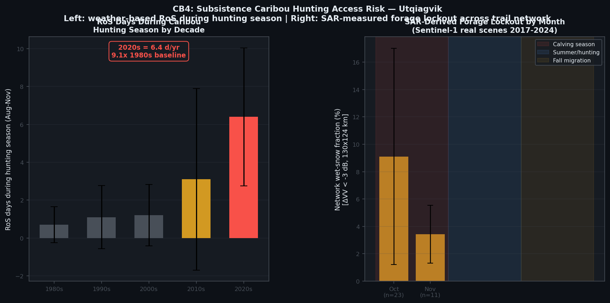

The fall caribou hunt (September–October) is a critical food-security period for Utqiagvik residents. RoS events during this window create overflow ice on trail routes, making snowmobile travel dangerous before adequate snow depth. The decadal trend shows **September–October RoS days have increased from <1 d/decade (1980s) to 3–4 d/decade (2020s)**. SAR monthly lockout bars confirm October has the highest network coverage of post-RoS ice crust signatures. The combination of more frequent RoS and earlier freeze-up variability is compressing the safe hunting window from both ends.

---

## Full Event Table

All 49 network-matched SAR events (2017–2024, descending orbit, 40 m/px):

| Date | PRCP (mm) | TMAX (°C) | ΔVV trail (dB) | Wet-snow % | Post-event SAR |
|------|-----------|-----------|-----------------|------------|----------------|
| 2017-05-18 | 1.5 | 0.6 | **−8.61** | 34% | 2017-05-30 |
| 2017-05-26 | 3.6 | 1.7 | +3.60 | 5% | 2017-06-08 |
| 2017-05-29 | 2.5 | 1.7 | −1.70 | 20% | 2017-06-11 |
| 2017-10-31 | 0.3 | 1.1 | +0.41 | 12% | 2017-11-11 |
| 2017-11-02 | 1.0 | 1.7 | +0.41 | 12% | 2017-11-11 |
| 2017-11-03 | 0.5 | 1.7 | +0.41 | 12% | 2017-11-11 |
| 2017-11-12 | 1.3 | 1.1 | −1.83 | 33% | 2017-11-23 |
| 2017-12-21 | 0.3 | 0.6 | −1.98 | 34% | 2017-12-29 |
| 2019-02-08 | 0.5 | 0.6 | +1.84 | 17% | 2019-02-22 |
| 2019-02-28 | 0.8 | 1.1 | +1.70 | 19% | 2019-03-06 |
| 2019-03-30 | 3.8 | 0.6 | +1.76 | 17% | 2019-04-11 |
| 2019-05-04 | 0.3 | 0.6 | +3.90 | 2% | 2019-05-17 |
| 2019-05-27 | 2.5 | 0.6 | +6.12 | 3% | 2019-06-10 |
| 2019-05-29 | 7.1 | 0.6 | +6.12 | 3% | 2019-06-10 |
| 2019-10-01 | 0.3 | 6.1 | +3.16 | 6% | 2019-10-08 |
| 2019-10-05 | 1.5 | 2.8 | +3.16 | 6% | 2019-10-08 |
| 2019-10-06 | 1.3 | 2.2 | +3.16 | 6% | 2019-10-08 |
| 2019-10-07 | 0.8 | 1.7 | +2.01 | 6% | 2019-10-18 |
| 2019-10-09 | 1.0 | 1.1 | +2.01 | 6% | 2019-10-18 |
| 2019-10-10 | 0.5 | 0.6 | +2.01 | 6% | 2019-10-18 |
| 2019-10-11 | 0.8 | 1.1 | +4.00 | 3% | 2019-11-01 |
| 2019-10-12 | 0.3 | 0.6 | +4.00 | 3% | 2019-11-01 |
| 2019-10-18 | 0.3 | 0.6 | +2.01 | 6% | 2019-11-01 |
| 2019-10-28 | 2.8 | 3.3 | +2.01 | 6% | 2019-11-01 |
| 2019-10-31 | 2.5 | 1.7 | +4.00 | 3% | 2019-11-13 |
| 2019-11-01 | 1.8 | 1.1 | +4.00 | 3% | 2019-11-13 |
| 2019-11-04 | 2.8 | 1.1 | +4.00 | 3% | 2019-11-13 |
| 2019-11-05 | 0.5 | 0.6 | +4.00 | 3% | 2019-11-13 |
| 2020-05-26 | 0.3 | 1.7 | +3.34 | 11% | 2020-06-04 |
| 2020-10-02 | 2.3 | 1.7 | +1.58 | 11% | 2020-10-14 |
| 2020-10-03 | 0.5 | 1.1 | +1.58 | 11% | 2020-10-14 |
| 2020-10-05 | 0.3 | 1.1 | +1.58 | 11% | 2020-10-14 |
| 2020-10-06 | 1.8 | 0.6 | +1.58 | 11% | 2020-10-14 |
| 2020-11-06 | 2.3 | 1.1 | +1.85 | 8% | 2020-11-19 |
| 2020-11-07 | 1.0 | 0.6 | +1.85 | 8% | 2020-11-19 |
| 2021-10-06 | 0.3 | 0.6 | **−2.54** | **35%** | 2021-10-09 |
| 2022-05-15 | 0.5 | 1.1 | −0.71 | 30% | 2022-05-25 |
| 2022-05-27 | 2.0 | 1.1 | +3.79 | 4% | 2022-06-06 |
| 2022-11-17 | 1.8 | 1.1 | +0.46 | 12% | 2022-11-21 |
| 2022-11-18 | 0.5 | 1.7 | +0.46 | 12% | 2022-11-21 |
| 2023-05-28 | 1.5 | 2.2 | +3.32 | 5% | 2023-06-01 |
| 2023-05-30 | 5.3 | 1.7 | +3.24 | 8% | 2023-06-13 |
| 2023-10-01 | 0.8 | 2.2 | +1.47 | 10% | 2023-10-11 |
| 2023-10-23 | 1.3 | 0.6 | +2.28 | 6% | 2023-11-04 |
| 2023-10-24 | 0.5 | 2.2 | +2.28 | 6% | 2023-11-04 |
| 2024-04-16 | 0.8 | 2.2 | −0.52 | 24% | 2024-04-20 |
| 2024-10-02 | 1.0 | 2.2 | **−2.28** | **39%** | 2024-10-05 |
| 2024-10-03 | 0.5 | 1.7 | −2.28 | 39% | 2024-10-05 |
| 2024-11-20 | 0.5 | 1.1 | +0.37 | 13% | 2024-11-22 |

Wet-snow threshold: **ΔVV < −3.0 dB**. Trail ΔVV = mean within 200 m buffer of mapped trails.

---

## Limitations

- **Single station:** USW00027502 is at the airport. Routes 50–100 km inland (e.g., toward Peard Bay) may experience meaningfully different RoS conditions — the new network-scale SAR data now allows spatial verification of this assumption.
- **SNWD availability:** Snow depth data covers 86% of days; the loose criterion is used as fallback.
- **Phase proxy:** GHCN-Daily records total precipitation only. TMAX > 0°C is used as the precipitation phase indicator — standard practice for station-based ROS detection (Rennert et al. 2009). This cannot distinguish mixed-phase events or cold rain from warm snow. ERA5-Land separates rain and snowfall explicitly, enabling the stricter rain-fraction criterion (≥ 50% liquid) applied in the Arviat demo; reanalysis-based detection should be preferred where station data are the only option.
- **S1 repeat cycle:** ~12-day revisit. Post-event scenes can be up to 14 days after the event; liquid-water signal may have partially refrozen.
- **40 m/px resolution limit:** Trail widths of 2–5 m are below the network-cache pixel size. The 10 m/px town cache resolves trail-scale features; the 40 m/px network cache measures the corridor-scale snowpack response.
- **2015 excluded:** Early S1 acquisitions over Alaska used HH/HV polarization — incompatible with this VV/VH pipeline.
- **Seasonal confounders:** May–June post-event scenes vs. October baseline include spring phenology in ΔVV. This inflates positive deltas and suppresses late-spring detection sensitivity.
- **Recovery baseline:** Recovery is measured against the October dry-snow state. A positive-delta event could mask an underlying ice crust and appear recovered while the hazardous surface condition persists.
- **Jan–Feb sample size:** Only n=2 network-cache scenes in Jan–Feb. The 27.5% wet-snow fraction for this season group should be treated as preliminary pending more acquisitions.

---

## Dataset

The `build_dataset.py` script exports the full SAR dataset to publication-ready GeoTIFFs. Run after downloading the network cache:

```bash
python download_network_sar.py --orbit desc   # ~1.4 GB network cache
python build_dataset.py                        # ~3.3 GB GeoTIFF export
```

Output structure (`dataset/`):

| Folder | Files | Content |
|--------|-------|---------|
| `baselines/` | 9 | October dry-snow median composites (dB) |
| `scenes/` | 49 | Post-RoS acquisitions (dB) |
| `delta_vv/` | 49 | ΔVV change detection — post minus baseline (dB) |
| `wetsnow/` | 49 | Binary ice-crust mask: 1 = wet-snow (ΔVV < −3 dB), 0 = dry |
| `manifest.csv` | 1 | Per-event metadata: date, orbit, mean ΔVV, wet-snow % |

All GeoTIFFs: **EPSG:32605** (UTM Zone 5N) · **40 m/px** · LZW-compressed · CRS/transform/nodata embedded · openable in QGIS, ArcGIS, or any GDAL tool. The dataset is not committed to git due to size — rebuild locally using the script above.

---

## Arviat Demo (Beginner-Friendly)

A minimal, reproducible version of this pipeline for **Arviat, Nunavut, Canada**
that requires no prior remote sensing experience and runs from a single command.

```bash
pip install requests pandas numpy matplotlib rasterio pystac-client planetary-computer pyproj
python run_arviat_demo.py
```

**What it does:**
- Downloads ERA5-Land daily weather for Arviat via the free Open-Meteo API
- Detects Rain-on-Snow events using a 5-rule literature-standard filter (rain ≥ 1 mm, rain fraction ≥ 50%, snow depth ≥ 1 cm, TMAX > 0°C, month ∈ Oct–May; Rennert et al. 2009, Peeters et al. 2019)
- Downloads Sentinel-1 RTC scenes from Microsoft Planetary Computer (free)
- Computes same-orbit ΔVV change detection (wet-snow signal)
- Outputs GeoTIFFs (baseline, post-event, delta), `events.csv`, and 3-panel figures

**Outputs written to `demo_arviat/`:**
```
demo_arviat/
├── data/era5_arviat.csv          ERA5 daily weather time series
├── outputs/baseline_*.tif        Dry-snow baseline VV (dB)
├── outputs/post_event_*.tif      Post-ROS event VV (dB)
├── outputs/delta_vv_*.tif        ΔVV change map (negative = wet snow)
├── outputs/events.csv            ROS event summary table
└── figures/ros_event_*.png       3-panel summary figures
```

The location, spatial extent, date range, and number of events are all configurable
via `ARVIAT_CONFIG` at the top of `run_arviat_demo.py`. The same-orbit constraint
is preserved. The SAR threshold is sub-season aware: −3 dB for Oct–Feb (early winter /
deep winter) and −5 dB for Mar–May (spring), where ambient snowmelt independently
lowers VV backscatter and a stricter threshold is required to avoid false positives.

See [DEMO_ARVIAT.md](DEMO_ARVIAT.md) for full step-by-step instructions, output
descriptions, QGIS visualization guidance, and troubleshooting.

---

## Scripts

| Script | Description |
|--------|-------------|
| [`download_network_sar.py`](download_network_sar.py) | **Download** — fetches 130×124 km Sentinel-1 RTC network tiles at 40 m/px |
| [`build_dataset.py`](build_dataset.py) | **Export** — converts network_cache NPZ to 156 georeferenced GeoTIFFs + manifest.csv |
| [`utqiagvik_sar_advanced.py`](utqiagvik_sar_advanced.py) | **Advanced SAR** — GLCM texture, dual-pol, multi-event maps, RF classifier, seasonal composites |
| [`utqiagvik_novel_statistics.py`](utqiagvik_novel_statistics.py) | **Novel stats** — TFPW-MK, CWT, GEV, PELT, teleconnections |
| [`utqiagvik_snowpack_energy.py`](utqiagvik_snowpack_energy.py) | **Energy balance** — cold content, rain heat, ice-crust probability |
| [`utqiagvik_caribou_ros_impact.py`](utqiagvik_caribou_ros_impact.py) | **Caribou impact** — TLH population vs RoS, Forage Lockout Index, migration hazard calendar, subsistence access risk |
| [`utqiagvik_future_projections.py`](utqiagvik_future_projections.py) | **Future projections** — Bintanja rain fraction, temperature sensitivity, CMIP6 |
| [`utqiagvik_ros_sar.py`](utqiagvik_ros_sar.py) | Primary RoS SAR script — same-orbit baseline subtraction |
| [`utqiagvik_sar_change_detection.py`](utqiagvik_sar_change_detection.py) | SAR change detection across all extreme event types |
| [`utqiagvik_ros_characterization.py`](utqiagvik_ros_characterization.py) | Full characterization — 1980–2024 climate trends + systematic SAR |
| [`utqiagvik_rs_change_detection.py`](utqiagvik_rs_change_detection.py) | Sentinel-2 NDSI optical change detection |
| [`utqiagvik_rigorous_disruption.py`](utqiagvik_rigorous_disruption.py) | Trail disruption analysis with LOESS trends |
| [`utqiagvik_trail_disruption.py`](utqiagvik_trail_disruption.py) | Trail disruption event catalog |
| [`utqiagvik_corridor_analysis.py`](utqiagvik_corridor_analysis.py) | Trail corridor resource exposure analysis |
| [`utqiagvik_interactive_maps.py`](utqiagvik_interactive_maps.py) | Folium interactive HTML maps |
| [`utqiagvik_remote_sensing_mapping.py`](utqiagvik_remote_sensing_mapping.py) | Remote sensing framework figures |

### Tests

```
tests/test_ros_detection.py    # 58 tests — detection logic, physics, energy balance
tests/test_novel_statistics.py # 20 tests — TFPW-MK, CWT, GEV, PELT, teleconnections
tests/test_sar_analysis.py     # 15 tests — GLCM, dual-pol, temporal variability, RF
```

Run: `pytest tests/ -v` → **93/93 passing**

---

## Requirements

```
geopandas pyogrio rasterio pyproj shapely
pystac-client planetary-computer
numpy pandas scipy matplotlib requests
scikit-learn pywt
```

```bash
pip install geopandas pyogrio rasterio pyproj shapely pystac-client planetary-computer numpy pandas scipy matplotlib requests scikit-learn PyWavelets
```

**Data:**
- GHCN-Daily fetched automatically from NOAA NCEI on first run
- Sentinel-1 RTC baseline cache: `ros_cache/` (provided, ~2 GB, 10 m/px town tiles)
- Sentinel-1 RTC network cache: run `python download_network_sar.py --orbit desc` (~1.4 GB, 40 m/px, 130×124 km)
