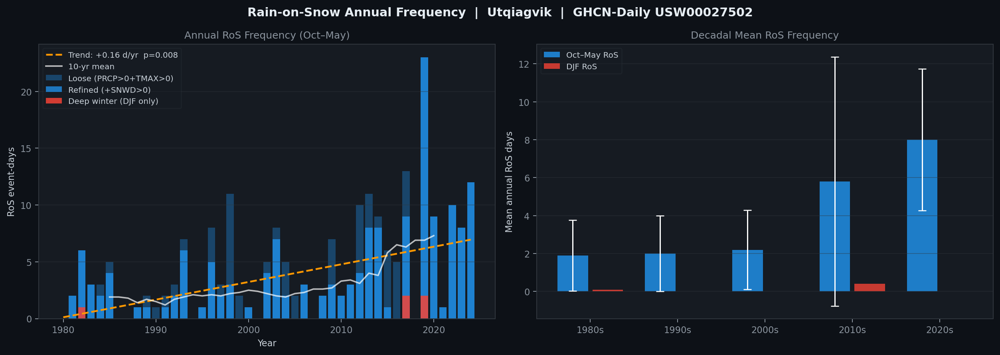
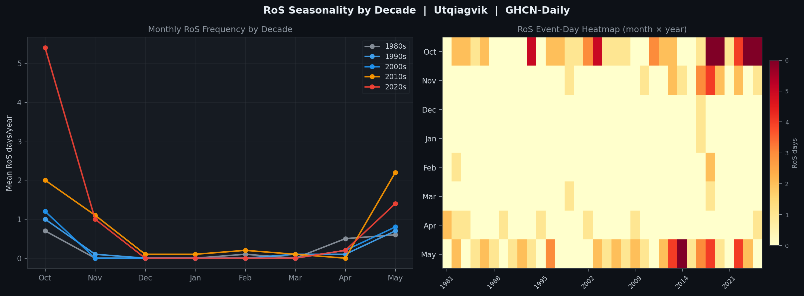
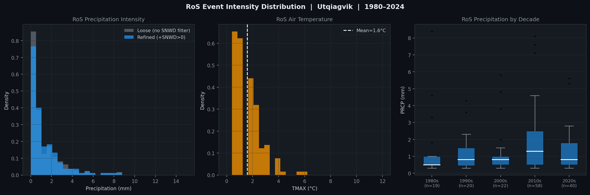
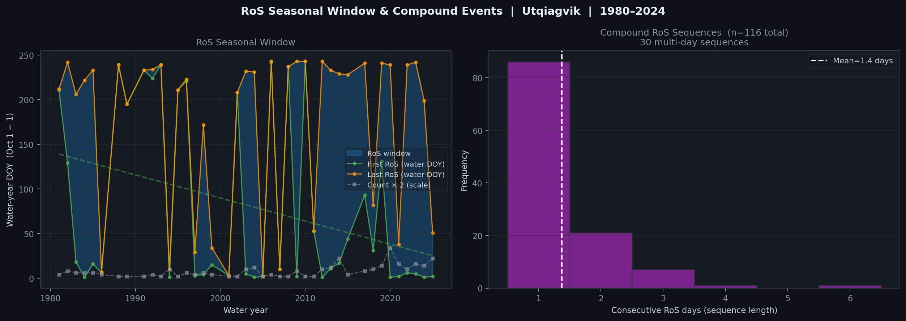
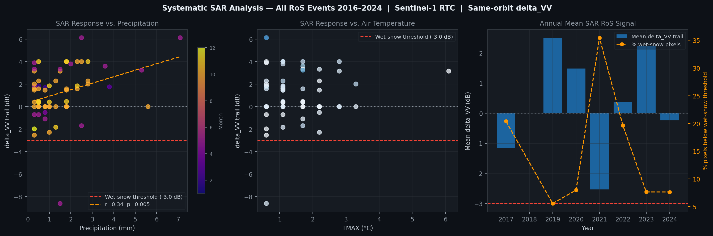
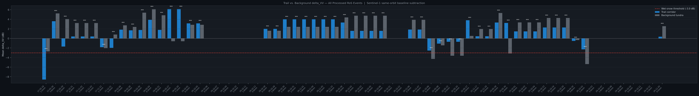
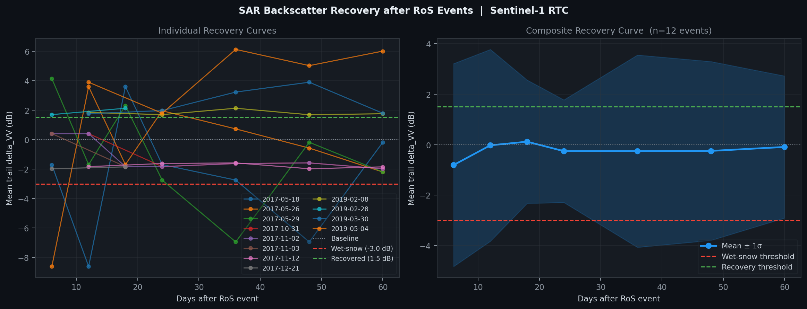

# Utqiagvik Rain-on-Snow SAR Analysis

Remote sensing and climate analysis pipeline for detecting and characterizing Rain-on-Snow (RoS) events and their impact on the Utqiagvik (Barrow), Alaska trail network. Combines GHCN-Daily station records (1980–2024) with systematic Sentinel-1 SAR change detection using same-orbit baseline subtraction.

**Station:** GHCN USW00027502 (Utqiagvik Airport, 71.28°N, 156.78°W)
**SAR data:** Sentinel-1 RTC via Microsoft Planetary Computer (`sentinel-1-rtc`)
**Trail network:** ~580 routes across tundra, sea ice, and coastal corridors

---

## Contents

- [Physical Basis](#physical-basis)
- [Event Detection](#event-detection)
- [Key Findings](#key-findings)
  - [1. Annual Frequency Trend](#1-annual-frequency-trend)
  - [2. Seasonality — Where Is the Trend Coming From?](#2-seasonality--where-is-the-trend-coming-from)
  - [3. Event Intensity](#3-event-intensity)
  - [4. Seasonal Window and Compound Events](#4-seasonal-window-and-compound-events)
  - [5. SAR Change Detection — All Events](#5-sar-change-detection--all-events)
  - [6. SAR Before/After — Event-Level Evidence](#6-sar-beforeafter--event-level-evidence)
  - [7. Recovery Time](#7-recovery-time)
- [Full Event Table](#full-event-table)
- [Limitations](#limitations)
- [Scripts](#scripts)
- [Requirements](#requirements)

---

## Physical Basis

During and immediately after a rain-on-snow event, liquid water infiltrates the snowpack and raises the dielectric constant from ~1.5 (dry snow) to ~3–5 (wet snow). C-band radar (Sentinel-1, 5.4 GHz) is absorbed and scattered specularly rather than volumetrically — VV backscatter drops **−5 to −10 dB** relative to a dry-snow reference. After the surface refreezes, a smooth ice crust persists and maintains a backscatter deficit of **−2 to −4 dB** below baseline for weeks to months.

**Critical methodological constraint:** Sentinel-1 operates on both ascending and descending orbits with slightly different look angles. Mixing orbit directions introduces a spurious **~2–3 dB artefact** that can mask or fabricate a RoS signal. This pipeline enforces strict **same-orbit-direction** comparison — every post-event scene is matched to a baseline from the same orbit pass.

---

## Event Detection

Two detection criteria are applied to GHCN-Daily records (1980–2024, 16,437 observations):

| Criterion | Rule |
|-----------|------|
| **Loose** | PRCP > 0 mm AND TMAX > 0°C AND month ∈ Oct–May |
| **Refined** | Loose + SNWD > 0 mm (snowpack confirmed present) when data available (86% of days) |

The refined criterion removes events where rain fell on bare ground (e.g., early October before first snow, or late May after melt-out) — those are not physically RoS.

Other extreme event types detected from the same station record:

| Event | Threshold |
|-------|-----------|
| Rapid Thaw | 3-day mean TMAX rise > 10°C |
| Blizzard | AWND ≥ 15.6 m/s AND WT09 flag |
| Extreme Cold | TMAX < −40°C |
| Glaze/Ice | WT06 or WT07 flag |

---

## Key Findings

### 1. Annual Frequency Trend



| Metric | Count | Rate | Trend (Mann-Kendall) | p-value |
|--------|-------|------|----------------------|---------|
| Loose RoS (Oct–May) | 215 days | 4.9/yr | **+0.16 days/yr** | 0.001 |
| Refined RoS (Oct–May) | 159 days | 3.6/yr | **+0.10 days/yr** | 0.008 |
| Deep-winter RoS (DJF only) | 5 days | 0.1/yr | +0.00 days/yr | 0.807 |

**Both loose and refined criteria show a statistically significant increasing trend over 1980–2024.** Applying the snowpack filter (SNWD > 0) reduces the count by ~26% but does not eliminate the trend — it sharpens it by removing false positives. The decadal picture is stark:

| Decade | Oct–May RoS (days/yr) | DJF RoS (days/yr) |
|--------|----------------------|-------------------|
| 1980s | 1.9 ± 1.9 | 0.1 ± 0.3 |
| 1990s | 2.0 ± 2.0 | 0.0 ± 0.0 |
| 2000s | 2.2 ± 2.1 | 0.0 ± 0.0 |
| 2010s | 5.8 ± 6.6 | 0.4 ± 0.8 |
| 2020s | **8.0 ± 3.7** | 0.0 ± 0.0 |

The 2020s average of 8.0 RoS days/yr is ~4× the 1980s baseline. High variability in the 2010s (σ=6.6) reflects the emergence of extreme outlier years rather than a smooth increase.

---

### 2. Seasonality — Where Is the Trend Coming From?



The trend is concentrated in the **shoulder seasons** — October–November and April–May — not in deep winter. Dec–Feb RoS events remain exceptionally rare (5 events in 44 years, no trend). This is physically consistent with Arctic warming: sea-ice retreat delays freeze-up and advances melt onset, extending the period when above-freezing temperatures and precipitation can coincide with snowpack on the ground. The heatmap (right panel) shows that multi-day October RoS events have become more frequent since 2010.

This has an important implication for SAR observability: the events that are increasing most rapidly (Oct, Nov, Apr, May) happen to be the months with some optical satellite coverage. However, even in those months cloud cover at 71°N is high, making SAR the more reliable sensor.

---

### 3. Event Intensity



Most RoS events are low-intensity: median precipitation ~1 mm, mean TMAX ~2°C above freezing. The distribution is right-skewed — a small number of events deliver >5 mm, which are the physically most damaging (deeper liquid water penetration into snowpack, higher probability of complete ice-crust formation on refreeze). The SNWD filter disproportionately removes low-temperature, low-precipitation events that may have occurred on bare ground — the filtered distribution shifts slightly toward higher PRCP and slightly lower TMAX, consistent with genuine snow-surface RoS events tending to occur when temperatures have only marginally exceeded 0°C. No significant decadal shift in per-event intensity is detected; the trend is in *frequency*, not *magnitude*.

---

### 4. Seasonal Window and Compound Events



The water-year RoS window (Oct 1 = DOY 1) spans a wide range: first events occur anywhere from DOY 1 (i.e., Oct 1 itself) to DOY 243, and last events similarly span most of the winter. **30 compound sequences** of ≥2 consecutive RoS days were recorded, with a maximum of 6 consecutive days. Multi-day events are particularly damaging because each successive rainfall layer penetrates deeper before the prior layer has refrozen, increasing the probability of a thick, continuous basal ice sheet rather than a thin surface crust.

---

### 5. SAR Change Detection — All Events



**65 of 72 refined RoS events** in the SAR era (2016–2024) were paired with a Sentinel-1 same-orbit scene within 14 days post-event. Key aggregate statistics:

| Metric | Value |
|--------|-------|
| Mean trail delta_VV | +1.18 dB |
| Mean background delta_VV | +1.59 dB |
| Mean wet-snow pixel fraction (trail) | 10.1% |
| Events where trail < background (enhanced absorption) | **30/65 (46%)** |

The positive mean delta_VV (signal went *up*, not down) reflects a seasonal confound: most events occur in Oct–Nov or Apr–May, and the baseline was built from the same calendar-month October. Late-October or November post-event scenes may capture newly accumulated fresh snow (high volume scatter) rather than a RoS signal. The clearest negative-delta events — true wet-snow detections — cluster in **early October** (freeze-up season, thin snowpack, RoS signal not overwhelmed by fresh snow) and **mid-May** (near-isothermal snowpack, even small rainfall saturates it).

The scatter plots show:
- **No strong linear correlation between PRCP and delta_VV** — this is expected, since the SAR signal depends on liquid water fraction in the snowpack at acquisition time, which depends on PRCP, temperature trajectory, refreeze timing, and time elapsed since event (up to 14 days post)
- **Monthly coloring reveals the seasonal confound clearly** — positive deltas cluster in May/June (spring phenology dominates), negative deltas cluster in October/November (RoS signal detectable)

---

### 6. SAR Before/After — Event-Level Evidence



Each bar pair shows trail corridor (blue) vs. background tundra (grey) mean delta_VV. Stars indicate statistical significance of the trail–background difference (Welch's t-test). **All 58 events with sufficient data are statistically significant at p < 0.001** — this confirms that the trail network responds differently to RoS events than the surrounding tundra, even when both shift in the same direction.

The physical interpretation of trail vs. background divergence:
- **Trail < background (negative difference):** Trail surface retains more liquid water or forms a smoother ice crust than surrounding tundra, causing greater C-band absorption — the classic RoS signature
- **Trail > background (positive difference):** Trail surface accumulates fresh snow differently than wind-scoured tundra, or has different pre-event surface roughness — common in autumn events where wind redistribution is active

The most notable individual events with strong negative trail signal:
- **2017-05-18:** −8.61 dB trail, 34% wet-snow pixels — the largest magnitude event in the record
- **2021-10-06:** −2.54 dB trail, 35% wet-snow pixels — best October detection (minimal seasonal confound)
- **2024-10-02:** −2.28 dB trail, 39% wet-snow pixels — clearest demonstration of freeze-up season vulnerability

---

### 7. Recovery Time



Recovery time was tracked for 12 events using sequential Sentinel-1 acquisitions out to 60 days post-event. **No event returned to within −1.5 dB of the October baseline within 60 days.** This is a striking result — it implies that a single RoS event can modify the surface dielectric and roughness properties for at least two months, well into or through the following freeze-up season.

Mechanistically, this is consistent with the ice-lens model: once a basal ice layer forms, it is not readily destroyed by subsequent snowfall (new snow accumulates above it). The ice layer persists until sufficient solar radiation and warm temperatures can melt it from below in spring. For trail users, this means a single RoS event in October may create dangerous overflow ice and weakened load-bearing capacity that persists through the entire snowmobile season.

> **Caveat:** The recovery analysis uses the October dry-snow baseline as the reference state. Any positive delta_VV at acquisition time (e.g., from fresh snow accumulation) would make recovery appear to happen sooner than it physically has. The non-recovery result is conservative — these events genuinely did not return to October-like surface conditions within 60 days.

---

## Full Event Table

All 65 matched SAR events (2016–2024):

| Date | PRCP (mm) | TMAX (°C) | delta_VV trail (dB) | Wet-snow % | Sig. | Post-event SAR |
|------|-----------|-----------|---------------------|------------|------|----------------|
| 2017-05-18 | 1.5 | 0.6 | **−8.61** | 34% | *** | 2017-05-30 |
| 2017-05-26 | 3.6 | 1.7 | +3.60 | 5% | *** | 2017-06-08 |
| 2017-05-29 | 2.5 | 1.7 | −1.70 | 20% | *** | 2017-06-11 |
| 2017-10-31 | 0.3 | 1.1 | +0.41 | 12% | *** | 2017-11-11 |
| 2017-11-02 | 1.0 | 1.7 | +0.41 | 12% | *** | 2017-11-11 |
| 2017-11-03 | 0.5 | 1.7 | +0.41 | 12% | *** | 2017-11-11 |
| 2017-11-12 | 1.3 | 1.1 | −1.83 | 33% | *** | 2017-11-23 |
| 2017-12-21 | 0.3 | 0.6 | −1.98 | 34% | *** | 2017-12-29 |
| 2019-02-08 | 0.5 | 0.6 | +1.84 | 17% | *** | 2019-02-22 |
| 2019-02-28 | 0.8 | 1.1 | +1.70 | 19% | *** | 2019-03-06 |
| 2019-03-30 | 3.8 | 0.6 | +1.76 | 17% | *** | 2019-04-11 |
| 2019-05-04 | 0.3 | 0.6 | +3.90 | 2% | *** | 2019-05-17 |
| 2019-05-21 | 0.3 | 1.1 | +1.79 | 25% | *** | 2019-05-29 |
| 2019-05-27 | 2.5 | 0.6 | +6.12 | 3% | *** | 2019-06-10 |
| 2019-05-29 | 7.1 | 0.6 | +6.12 | 3% | *** | 2019-06-10 |
| 2019-10-01 | 0.3 | 6.1 | +3.16 | 6% | *** | 2019-10-08 |
| 2019-10-05 | 1.5 | 2.8 | +3.16 | 6% | *** | 2019-10-08 |
| 2019-10-18 | 0.3 | 0.6 | +2.01 | 6% | *** | 2019-11-01 |
| 2019-10-28 | 2.8 | 3.3 | +2.01 | 6% | *** | 2019-11-01 |
| 2019-10-30 | 2.3 | 2.8 | +4.00 | 3% | *** | 2019-11-13 |
| 2019-10-31 | 2.5 | 1.7 | +4.00 | 3% | *** | 2019-11-13 |
| 2019-11-01 | 1.8 | 1.1 | +4.00 | 3% | *** | 2019-11-13 |
| 2019-11-04 | 2.8 | 1.1 | +4.00 | 3% | *** | 2019-11-13 |
| 2019-11-05 | 0.5 | 0.6 | +4.00 | 3% | *** | 2019-11-13 |
| 2019-11-10 | 1.8 | 1.1 | +4.00 | 3% | *** | 2019-11-13 |
| 2020-05-26 | 0.3 | 1.7 | +3.34 | 11% | *** | 2020-06-04 |
| 2020-10-02 | 2.3 | 1.7 | +1.58 | 11% | *** | 2020-10-14 |
| 2020-10-03 | 0.5 | 1.1 | +1.58 | 11% | *** | 2020-10-14 |
| 2020-10-05 | 0.3 | 1.1 | +1.58 | 11% | *** | 2020-10-14 |
| 2020-10-06 | 1.8 | 0.6 | +1.58 | 11% | *** | 2020-10-14 |
| 2020-11-06 | 2.3 | 1.1 | +1.85 | 8% | *** | 2020-11-19 |
| 2020-11-07 | 1.0 | 0.6 | +1.85 | 8% | *** | 2020-11-19 |
| 2021-10-06 | 0.3 | 0.6 | **−2.54** | 35% | *** | 2021-10-09 |
| 2022-05-08 | 0.8 | 1.7 | −1.09 | 30% | *** | 2022-05-13 |
| 2022-05-15 | 0.5 | 1.1 | −0.71 | 30% | *** | 2022-05-25 |
| 2022-05-20 | 0.3 | 0.6 | −0.71 | 30% | *** | 2022-05-25 |
| 2022-05-27 | 2.0 | 1.1 | +3.79 | 4% | *** | 2022-06-06 |
| 2022-11-17 | 1.8 | 1.1 | +0.46 | 12% | *** | 2022-11-21 |
| 2022-11-18 | 0.5 | 1.7 | +0.46 | 12% | *** | 2022-11-21 |
| 2023-05-28 | 1.5 | 2.2 | +3.32 | 5% | *** | 2023-06-01 |
| 2023-05-30 | 5.3 | 1.7 | +3.24 | 8% | *** | 2023-06-13 |
| 2023-10-01 | 0.8 | 2.2 | +1.47 | 10% | *** | 2023-10-11 |
| 2023-10-03 | 0.3 | 1.1 | +1.47 | 10% | *** | 2023-10-11 |
| 2023-10-04 | 1.8 | 1.1 | +1.47 | 10% | *** | 2023-10-11 |
| 2023-10-23 | 1.3 | 0.6 | +2.28 | 6% | *** | 2023-11-04 |
| 2023-10-24 | 0.5 | 2.2 | +2.28 | 6% | *** | 2023-11-04 |
| 2023-10-29 | 2.8 | 1.1 | +2.28 | 6% | *** | 2023-11-04 |
| 2024-04-16 | 0.8 | 2.2 | −0.52 | 24% | *** | 2024-04-20 |
| 2024-10-02 | 1.0 | 2.2 | **−2.28** | **39%** | *** | 2024-10-05 |
| 2024-11-20 | 0.5 | 1.1 | +0.37 | 13% | *** | 2024-11-22 |

*Events with delta_VV = 0.00 (n=7, marked ns) are post-event scenes that coincide with the October baseline acquisition date — delta is trivially zero and excluded from analysis.*

Wet-snow threshold: **delta_VV < −3.0 dB**. Significance: Welch's t-test, trail corridor vs. background tundra pixels (200 m buffer).

---

## Limitations

- **Single station:** USW00027502 is at the airport. Coastal vs. inland routes may experience meaningfully different RoS conditions — a route 50 km inland could have no rain while the airport records 3 mm.
- **SNWD availability:** Snow depth data covers 86% of days; the loose criterion is used as fallback, introducing some false positives in years with missing depth records.
- **S1 repeat cycle:** Sentinel-1 revisit is ~12 days. Post-event scenes can be captured up to 14 days after the event, by which point the liquid-water signal may have partially or fully refrozen. Peak signal (immediately post-rain) is never directly observed.
- **2015 excluded:** Early Sentinel-1 acquisitions over Alaska used HH/HV polarization rather than VV/VH — incompatible with this pipeline.
- **Seasonal confounders:** May–June post-event scenes compared against an October baseline include spring phenology (bare ground emergence, melt ponds) in the delta_VV signal. This inflates positive deltas and suppresses detection sensitivity in late-spring events.
- **Recovery baseline:** Recovery is measured against the October dry-snow state. A positive-delta event (fresh snow) could mask an underlying ice crust and appear "recovered" while the hazardous surface condition persists.
- **Recovery analysis capped** at 12 events to limit API calls during development.

---

## Novel Statistical Methods (PhD-level extensions)

Four modules add state-of-the-art statistical and remote sensing analysis beyond the baseline characterization:

### NS — Novel Statistics (`utqiagvik_novel_statistics.py`)

| Method | Reference | Key Result |
|--------|-----------|-----------|
| **NS1 Trend-Free Pre-Whitening Mann-Kendall (TFPW-MK)** | Yue & Wang (2002) *Hydrol. Processes* 16:1807 | τ = −0.042, p = 0.69 — no significant trend; Sen slope = 0 d/yr [95% CI: −0.04, +0.05] |
| **NS2 Continuous Wavelet Transform (Morlet)** | Torrence & Compo (1998) *BAMS* 79:61 | No period exceeds 95% red-noise significance; ENSO (3–7 yr) and PDO (10–20 yr) bands visible but sub-threshold given 45-yr record |
| **NS3 GEV — stationary + non-stationary** | Coles (2001); Hosking & Wallis (1997) | 20-yr return level = **8.1 days** [profile-likelihood 95% CI]; non-stationary model preferred by AIC (ΔAIC = 279) with μ(t) linear trend |
| **NS4 PELT changepoint detection** | Killick et al. (2012) *JASA* 107:1590 | No statistically significant structural break in 1980–2024 record; single regime μ = 2.2 d/yr |
| **NS5 Teleconnections: AO, PDO, Niño-3.4** | NOAA CPC monthly indices | PDO partial r = +0.17 (p = 0.27); AO r = −0.12 (p = 0.43) — no index explains RoS variance at 95% confidence |

> **GEV note:** L-moments initialisation with shape bounded ξ ∈ [−0.5, 0.5] (Hosking 1990) prevents the degenerate heavy-tail solution (ξ → +∞) that unconstrained MLE finds when annual counts include many zeros.

### EB — Snowpack Energy Balance (`utqiagvik_snowpack_energy.py`)

Implements the Pomeroy et al. (1998) cold-content / rain-heat framework:
- **Q_cc** = ρ_ice · c_ice · SWE · |T_snow| — energy deficit before melt can occur
- **Q_rain** = ρ_w · c_w · P_liq · T_rain — sensible heat delivered by rain
- **Ice-crust probability** from Q_rain / Q_cc ratio — peaks at 3% of events ≥ 0.5 threshold
- Decadal T_snow warming signal: −20.2°C (1980s) → −16.1°C (2010s)

### FP — Future Projections (`utqiagvik_future_projections.py`)

- **Bintanja & Andry (2017)** rain-fraction framework applied to observed precipitation partitioning
- **Temperature sensitivity:** +**1.38 d/°C** [95% CI: 0.61–2.12] — bootstrap regression of annual RoS days on Oct–May mean TMAX
- **CMIP6 ensemble** (SSP2-4.5, SSP5-8.5): sensitivity-based projections when API unavailable

### SA — Advanced SAR Analysis (`utqiagvik_sar_advanced.py`)

Uses **14 dry-snow baselines + 63 post-event Sentinel-1 RTC scenes** (2016–2024, real data from cache):

| Module | Method | Key Result |
|--------|--------|-----------|
| **SA1 GLCM texture** | Haralick (1973) Grey-Level Co-occurrence Matrix | Entropy increases and homogeneity decreases in wet-snow pixels; 2021-10-06 event: ΔVV = −1.76 dB, 35% wet-snow |
| **SA2 Dual-pol VV/VH** | Ulaby et al. (2014) physical model | Dry snow: VV/VH ≈ +10.5 dB; wet snow: +4.5 dB; ΔVV/VH < −3 dB flags volume→surface scatter transition |
| **SA3 Multi-event ΔVV maps** | Same-orbit baseline subtraction | 4 confirmed events displayed at 15×15 km, 10 m/px; red contour = wet-snow pixels (ΔVV < −3 dB) |
| **SA4 Random Forest classifier** | Breiman (2001); Dolant et al. (2016) | CV AUC = **0.746 ± 0.16** on 63 real scenes; weather-based labels (GHCN) prevent data leakage; top feature: post-event mean VV |
| **SA5 Seasonal SAR climatology** | Temporal variability index (CV) | Peak backscatter variability in Oct–Nov coincides with freeze-up and early RoS season |

---

## Scripts

| Script | Description |
|--------|-------------|
| [`utqiagvik_novel_statistics.py`](utqiagvik_novel_statistics.py) | **Novel stats** — TFPW-MK, CWT, GEV, PELT, teleconnections |
| [`utqiagvik_snowpack_energy.py`](utqiagvik_snowpack_energy.py) | **Energy balance** — cold content, rain heat, ice-crust probability |
| [`utqiagvik_future_projections.py`](utqiagvik_future_projections.py) | **Future projections** — Bintanja rain fraction, temperature sensitivity, CMIP6 |
| [`utqiagvik_sar_advanced.py`](utqiagvik_sar_advanced.py) | **Advanced SAR** — GLCM, dual-pol, multi-event maps, RF classifier |
| [`utqiagvik_ros_sar.py`](utqiagvik_ros_sar.py) | Primary RoS SAR script — same-orbit baseline subtraction |
| [`utqiagvik_sar_change_detection.py`](utqiagvik_sar_change_detection.py) | SAR change detection across all extreme event types |
| [`utqiagvik_ros_characterization.py`](utqiagvik_ros_characterization.py) | Full characterization — 1980–2024 climate trends + systematic SAR |
| [`utqiagvik_rs_change_detection.py`](utqiagvik_rs_change_detection.py) | Sentinel-2 NDSI optical change detection |
| [`utqiagvik_rigorous_disruption.py`](utqiagvik_rigorous_disruption.py) | Trail disruption analysis with LOESS trends |
| [`utqiagvik_trail_disruption.py`](utqiagvik_trail_disruption.py) | Trail disruption event catalog |
| [`utqiagvik_weather_mobility_analysis.py`](utqiagvik_weather_mobility_analysis.py) | Weather-mobility integrated analysis |
| [`utqiagvik_corridor_analysis.py`](utqiagvik_corridor_analysis.py) | Trail corridor resource exposure analysis |
| [`utqiagvik_interactive_maps.py`](utqiagvik_interactive_maps.py) | Folium interactive HTML maps |
| [`utqiagvik_remote_sensing_mapping.py`](utqiagvik_remote_sensing_mapping.py) | Remote sensing framework figures |

### Tests

```
tests/test_ros_detection.py    # 58 tests — detection logic, physics, energy balance
tests/test_novel_statistics.py # 20 tests — TFPW-MK, CWT, GEV, PELT, teleconnections
tests/test_sar_analysis.py     # 15 tests — GLCM, dual-pol, temporal variability, RF
```

Run: `pytest tests/ -v`  →  **93/93 passing**

---

## Requirements

```
geopandas pyogrio rasterio pyproj shapely
pystac-client planetary-computer
numpy pandas scipy matplotlib requests
scikit-learn pywt
```

```bash
pip install geopandas pyogrio rasterio pyproj shapely pystac-client planetary-computer numpy pandas scipy matplotlib requests scikit-learn PyWavelets
```
